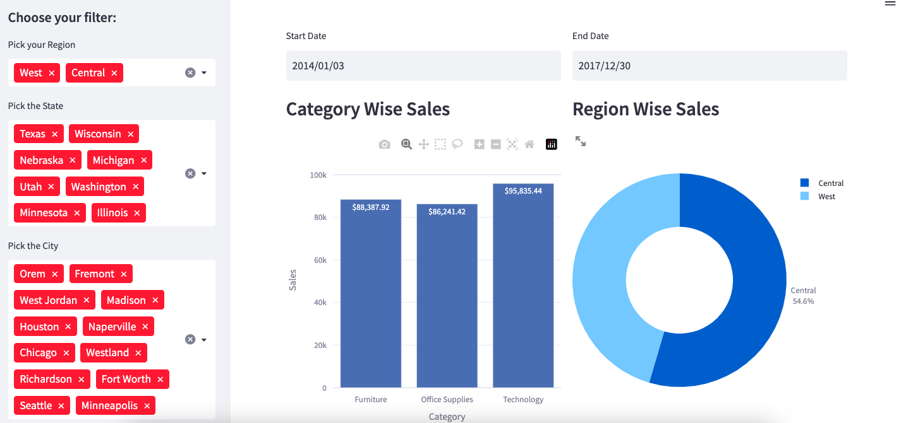
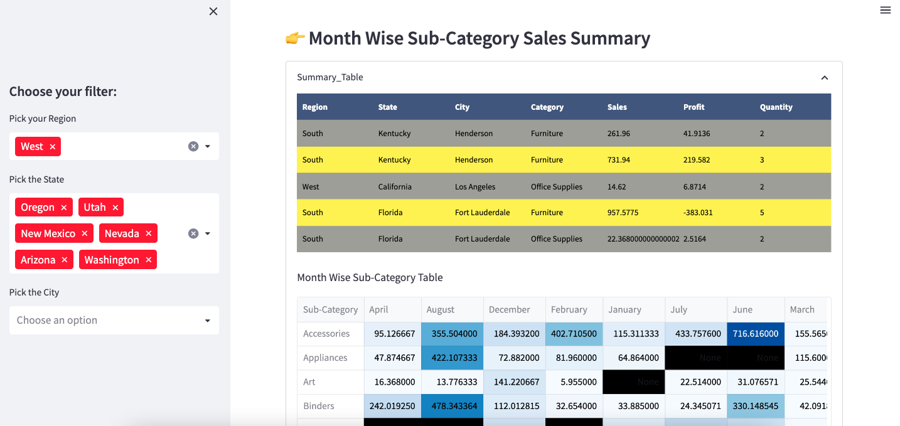

# Exploratory Data Analysis on Sales Data Using Streamlit and Plotly

This project conducts an in-depth exploratory data analysis (EDA) on sales data utilizing Streamlit and Plotly, two powerful Python libraries for interactive data visualization. The primary focus is on analyzing the sales data across different regions, states, and cities, offering insightful visual representations through various graphs and charts including bar graphs, tree maps, pie charts, and time series plots.

## Table of Contents

- [Overview](#overview)
- [Installation](#installation)
- [Usage](#usage)
- [Features](#features)
- [Contributing](#contributing)
- [License](#license)

## Overview

In this project, we leverage Python's pandas library to extract and preprocess the sales data. The processed data is then utilized to generate interactive visualizations using Plotly, allowing users to dynamically explore and understand the sales trends and patterns across different regions, states, and cities.






## Installation

1. Clone the repository from GitHub:

```bash
git clone https://github.com/mddmustainbillah/Superstore_plotly_streamlit_dashboard.git
```

2. Change the working directory to the project folder:
```bash
cd Superstore_plotly_streamlit_dashboard
```

3. Install the required Python dependencies using pip:
```bash
pip install -r requirements.txt
```


## Usage

1. Ensure you have the necessary data available for analysis.
2. Run the Streamlit application using the following command:

```bash
streamlit run app.py
```


3. Open the provided URL in your web browser to access the interactive visualizations and explore the sales data.

## Features

- Interactive visualization of sales data.
- Analysis of sales trends across different regions, states, and cities.
- Customizable visualizations for better insights.

## Contributing

Contributions are always welcome! If you have any suggestions, enhancements, or issues, please feel free to open an issue or create a pull request.

## License

This project is licensed under the [MIT License](https://opensource.org/licenses/MIT) - see the [LICENSE](LICENSE) file for details.


